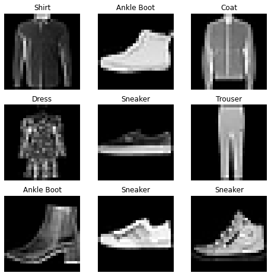
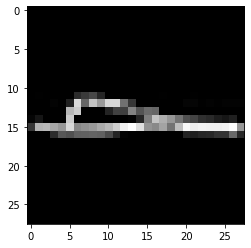

```python
import torch
from torch.utils.data import Dataset
from torchvision import datasets
from torchvision.transforms import ToTensor
import matplotlib.pyplot as plt
```

# 1. Download Datasets


```python
training_data = datasets.FashionMNIST(
    root = "data",
    train = True,
    download = True,
    transform = ToTensor()
)

test_data = datasets.FashionMNIST(
    root = "data",
    train = False,
    download = True,
    transform = ToTensor()
)
```

    Downloading http://fashion-mnist.s3-website.eu-central-1.amazonaws.com/train-images-idx3-ubyte.gz to data\FashionMNIST\raw\train-images-idx3-ubyte.gz
    


    HBox(children=(HTML(value=''), FloatProgress(value=0.0, max=26421880.0), HTML(value='')))


    
    Extracting data\FashionMNIST\raw\train-images-idx3-ubyte.gz to data\FashionMNIST\raw
    Downloading http://fashion-mnist.s3-website.eu-central-1.amazonaws.com/train-labels-idx1-ubyte.gz to data\FashionMNIST\raw\train-labels-idx1-ubyte.gz
    


    HBox(children=(HTML(value=''), FloatProgress(value=0.0, max=29515.0), HTML(value='')))


    
    Extracting data\FashionMNIST\raw\train-labels-idx1-ubyte.gz to data\FashionMNIST\raw
    Downloading http://fashion-mnist.s3-website.eu-central-1.amazonaws.com/t10k-images-idx3-ubyte.gz to data\FashionMNIST\raw\t10k-images-idx3-ubyte.gz
    


    HBox(children=(HTML(value=''), FloatProgress(value=0.0, max=4422102.0), HTML(value='')))


    
    Extracting data\FashionMNIST\raw\t10k-images-idx3-ubyte.gz to data\FashionMNIST\raw
    Downloading http://fashion-mnist.s3-website.eu-central-1.amazonaws.com/t10k-labels-idx1-ubyte.gz to data\FashionMNIST\raw\t10k-labels-idx1-ubyte.gz
    


    HBox(children=(HTML(value=''), FloatProgress(value=0.0, max=5148.0), HTML(value='')))


    
    Extracting data\FashionMNIST\raw\t10k-labels-idx1-ubyte.gz to data\FashionMNIST\raw
    Processing...
    Done!

    C:\Users\s_taehyeong1998\Anaconda3\lib\site-packages\torchvision\datasets\mnist.py:479: UserWarning: The given NumPy array is not writeable, and PyTorch does not support non-writeable tensors. This means you can write to the underlying (supposedly non-writeable) NumPy array using the tensor. You may want to copy the array to protect its data or make it writeable before converting it to a tensor. This type of warning will be suppressed for the rest of this program. (Triggered internally at  ..\torch\csrc\utils\tensor_numpy.cpp:143.)
      return torch.from_numpy(parsed.astype(m[2], copy=False)).view(*s)
    

    
    

## 1-1. Check Downloading result(Sample Visualization)


```python
labels_map = {0:"T-Shirt",
             1:"Trouser",
             2:"Pullover",
             3:"Dress",
             4:"Coat",
             5:"Sandal",
             6:"Shirt",
             7:"Sneaker",
             8:"Bag",
             9:"Ankle Boot"}

figure = plt.figure(figsize=(8,8))
cols,rows = 3,3
for i in range(1,cols*rows+1):
    sample_idx = torch.randint(len(training_data),size=(1,)).item()
    img,label = training_data[sample_idx]
    figure.add_subplot(rows,cols,i)
    plt.title(labels_map[label])
    plt.axis("off")
    plt.imshow(img.squeeze(),cmap="gray")
plt.show()
```


    

    


# 2. Make Own Dataset

1. __init__ : Dataset 객체가 생성될 때 한번만 실행, 생성자 초기화
            -> 이미지/Label 포함된 디렉토리 및 변형을 위한 함수 초기화
2. __len__ : Dataset이 포함하고 있는 Sample 개수 변환 
3. __getitem__ : 주어진 인덱스 idx에 해당하는 샘플을 데이터 셋에서 불러오고 반환
                  -> 인덱스 기반으로 Sample을 Tensor로 변환, Label 또한 가져옴

## 2-1. Example Code


```python
import os
import pandas as pd
from torchvision.io import read_image

class CustomImageDataset(Dataset):
    def __init__(self, annotations_file, img_dir, transform = None, target_transform = None):
        self.img_labels = pd.read_csv(annotations_file)
        self.img_dir = img_dir
        self.transform = transform
        self.target_transform = target_transform
    
    def __len__(self):
        return len(self.img_labels)

    def __getitem__(self,idx):
        img_path = os.path.join(self.img_dir, self.img_labels.ilox[idx,0])
        image = read_image(img_path)
        label = self.img_labels.ilox[idx,1]
        if self.transform:
            image = self.transform(image)
        if self.target_transform:
            label = self.target_transform(label)
        return image,label
```

# 3. DataLoader

#DataLoader<br>
Dataloader : 간단한 사용법으로 대부분의 딥러닝에서 사용하는 객체


```python
from torch.utils.data import DataLoader

train_dataloader = DataLoader(training_data, batch_size = 64, shuffle = True)
test_dataloader = DataLoader(test_data, batch_size = 64, shuffle = True)
```


```python
train_features,train_labels = next(iter(train_dataloader)) # train_dataloader에서 feature(img)와 label 가져옴
print("Feature Batch Shape:", {train_features.size()}) # Image의 크기 가져옴 ch : Batch Size x Ch x Width x Height
print("Labels Batch Shape:", {train_labels.size()}) # Label 의 크기 : 1차원
img = train_features[0].squeeze() # 1. train_features[0] : img 중 한 장 가져옴 (ch : 1x28x28)
                                  # 2. squeeze() : 1인 차원 제거 (ch : 28x28)
label = train_labels[0]
plt.imshow(img,cmap="gray")
plt.show()
print("Label :", labels_map[int(label)])
```

    Feature Batch Shape: {torch.Size([64, 1, 28, 28])}
    Labels Batch Shape: {torch.Size([64])}
    


    

    


    Label : Sandal
    
