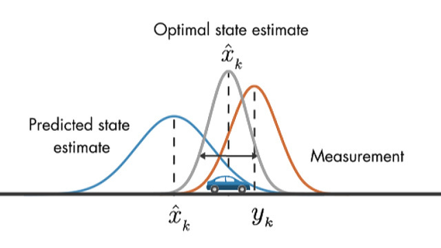

## Simple Online And Realtime Tracking With A Deep Association Metric

writer : Taehyeong Kim at Konkuk Univ.

E-mail : taehyeong1998@konkuk.ac.kr or taehyeong1998@kist.re.kr

Last Updated Date : 2022-10-31

---

# 0. Deep SORT란?

- Object Tracking Frame Work(객체 추적 프레임 워크) 로 SORT(Simple Online and Realtime Tracking)에 **Deep Learning**을 접목시켜 성능향상을 이룬 Frame Work 입니다.
    
    → SORT란 무엇이며, 어떻게 SORT에 Deep Learning을 접목시켜 성능 향상을 이루어냈는지 알아보겠습니다.
    
<br>


# 1. Research Background

- Deep SORT 를 이해하기 위한 사전 지식들에 대해 미리 알아보겠습니다.

| Prior Knowledges |
| --- |
| Kalman Filter |
| Hungarian Algorithm |
| Mahalanobis Distance |
| IoU(Intersection Over Union) |
| SORT(Simple Online and Real time Tracking) |

Kalman Filter

**Kalman Filter란?**

- **이전 프레임(또는 stage)에 등장한 개체를 이용하여 다음 프레임 개체의 위치를 예측하고 측정하는 방법**입니다.
- How does Kalman Filter predict?
    - 이전 프레임의 예측값의 분포(Predicted state estimate) + 현재 프레임의 측정값 분포(Measurement) ⇒ 최적 추정 값(Optimal State Estimate)
        <!--  -->
        

        
        → 예측값과 측정값의 각각의 Gaussian Distribution을 이용해 상태를 업데이트 해 최적의 추정값을 얻습니다.
        
- Why Do We use Kalman Filter for DeepSORT?
    
    A.  Sensor(Camera)로 받아들이는 Measurement 값 역시 Noise를 포함하고 있기 때문에 Kalman Filter로 처리하는데 효과적이기 때문입니다.
    
    또한 Tracking을 위한 영상에서는 물체의 이동이 선형적이기 때문에 마찬가지로 처리에 용이합니다.
    

**Assignment Problem(할당 문제)**

**Assignment Problem이란?**

- 다수의 공급처와 수요처가 존재하며, 수용비용이 모두 다를 때, 총 수송비용의 합이 최소가 되는 최적해를 찾는 문제입니다.
    - ex. “**노동자**(에어컨 수리기사) = **공급처** -> **작업**(에어컨 수리) = **수요처** 에 대해 **가장 적은 비용**의 해법”을 얻는 일련의 과정이라 할 수 있습니다.
- How to Solve Assignment Problem?
    - 할당 문제의 대표적인 해결법으로 Hungarian Algorithm이 있습니다.
    

**Hungarian Algorithm**

**Hungarian Algorithm이란?**

- 할당문제 & 헝가리안 알고리즘 : [https://gazelle-and-cs.tistory.com/29](https://gazelle-and-cs.tistory.com/29) 참조

**Mahalanobis Distance**

**Mahalanobis Distance란?**

- 평균과의 거리가 표준 편차의 몇 배인지 나타내는 값입니다.
- 좀 더 직관적으로 설명하자면 “어떤 경향이 있을 때, 이를 기준으로 새로운 데이터가 얼마나 일어나기 힘든 값인지?” 를 나타내주는 척도입니다.
    - ex. (0,0) 으로부터 네 점 (1,-1), (1,1), (1,-1), (-1,-1) 의 유클리드 거리는 모두 같지만, Mahalanobis 거리는 (1,-1)과 (-1,1)이 매우 큰 것을 볼 수 있습니다.
        
        ](https://user-images.githubusercontent.com/107748183/198959108-f34762d7-2d1c-49ff-9d5c-92f77384a76a.png)
        
        출처 : [https://kr.mathworks.com/help/stats/mahal.html](https://kr.mathworks.com/help/stats/mahal.html)
        
- Why Do We Use Mahalanobis Distance?
    - 어떤 데이터가 진짜 데이터인지, 가짜 데이터(Noise, False Alarm 등)인지 구별하는 용도로 사용하게 됩니다.

**IoU(Intersection over Union)**

**IoU란?**

- 겹치는 영역에 대해 수치화한 값을 말합니다.

$$
IoU = {Overlapping\;Region \over Combined \;Region}  
$$


**SORT(Simple Online and Realtime Tracking)**

**SORT란?**

- 실시간 추적을 위해 Object들을 효율적으로 연관(Associate)지어주는 MOT(Multi Object Tracking) 입니다.
    - MOT란?
        
        A. 다수의 객체들 추적을 위해 탐지된 객체들(Detected Objects) 간 연관지어주는 과정을 뜻합니다.
        
- Flow Chart of SORT
    
    
    
    출처 : 우측상단 표기
    
- What Exactly Happens in SORT?
    1. Detection : 프레임에서 객체를 탐지합니다.
    2. Estimation : Kalman Filter를 통해 추적을 위한 측정치 예측, 업데이트 과정을 진행합니다.
    3. Data Association :
        1. IoU 유사도를 구합니다.
        2. 추적되고 있던 객체와
            
            추적되지 않는 객체(사라진 객체, New 객체)를 분류합니다.
            
        
        b-1. 추적되고 있던 객체는 다시 Kalman Filter를 통해 다음 예측 값으로 사용됩니다.
        
        b-2. 사라진 객체(Unmatched Tracks)는 일정 시간 이후 삭제되며, New 객체(Unmatched Detections)는 새롭게 Track 생성 후 Track에 추가됩니다.
        
- Limitations of SORT?
    - Occlusion(폐색, 가려짐) 문제에 취약합니다.
        
        
        
        출처 : Measurement-wise Occlusion in Multi-object Tracking
        
    - ID Switching : 다양한 객체들이 움직일 때, 서로의 ID 추적이 변경되는 ID Switching에 취약합니다.
        
        
        
    

<br>

## 2. Research Objectivs

DeepSORT에서는

- SORT 의 문제점인 ID Switching과 Occlusion 문제를 해결하고자 했습니다.
- 동시에 좋은 성능(Good Performance)와 속도(Speed)를 유지하고자 했습니다.

---

## 3. Methodology

앞선 문제점들을 해결하기 위해 Deep SORT에서는 

**1.Deep Appearance Descriptor**로 **Re-identification 모델을 적용**해서 **ID** **Switching** 문제를 해결했습니다.

또한 

**2. Matching Cascade** 로직으로 더 정확한 추적을 가능케 하였습니다.

](https://user-images.githubusercontent.com/107748183/198959224-389e3dc3-8fbf-46a9-b066-97a5bb34eb91.jpg)

출처 : [https://www.researchgate.net/figure/Architecture-of-Deep-SORT-Simple-online-and-real-time-tracking-with-deep-association_fig2_353256407](https://www.researchgate.net/figure/Architecture-of-Deep-SORT-Simple-online-and-real-time-tracking-with-deep-association_fig2_353256407)

아래는 좀 더 자세한 FlowChart입니다.


출처 : 좌측상단 표기

**Process of DeepSORT**

1. Detection
    1. 이미지 input으로 받아 존재하는 물체에 대해 Bounding Box 정보 입력받음
2. Kalman Filter Predict
    1. 칼만 필터 통해 기존 Track 정보로부터 다음 frame 물체 위치 예측
3. Track Check
    1. 해당 Tracks들이 충분한 근거 가진 Track 인지 확인
    2. 3번 이상 물체 탐지해 Track으로 인정될 경우 “Confirm”, 그렇지 않을 경우 “Tentative” 로 표현
4. Matching Cascade
    1. Confirmed 인 Tracks에 대해 Matching 수행
    2. 이전보다 정확한 Track 정보 추출
5. IoU Matching
    1. Match되지 않은 Track, Detection 들에 대해 기존의 SORT에서 사용한 IoU 매칭 진행
    2. 새롭게 발견된 Detection에 대해 적용 / Matching 하지 못한 Track들 보완
6. Tracking Life Cycle
    1. 매칭 결과 기반으로 Track 객체 생애주기 결정
7. Kalman Filter Update
    1. 현재 가진 Matched Tracks를 다음 frame 위해 Bbox 예측 / Track 등장 횟수 3회 이상 시 상태 “Confirmed”로 변경
8. Reculsive

**Matching Cascade**

DeepSORT 에서는 Matching Cascade 단계를 추가하여 **개체의 상태를 좀 더 디테일하게 추출**하고자 했습니다.


다소 복잡해보이는 과정이지만 보다 보기 간단하게 Flowchart로 나타낸 Matching Cascade 흐름을 따라서 차근차근 알아보겠습니다.


- **distance 1 : Mahalanobis Distance**
    - 평균과의 거리가 표준편차의 몇 배인지 나타내는 값입니다.
        
        $d^{(1)}(i,j) = (d_j - y_i)^TS_i^{-1}(d_j-y_i)$
        
    
    | d_j |  j번째 bounding box detection |
    | --- | --- |
    | y_j | track data의 평균 값 |
    | S_i | Track Data의 공분산 행렬 |

- **distance 2 : Cosine Distance**
    - 물체가 가지는 모양을 판단하기 위한 Distance(Cosine 유사도를 활용한 Distance)
    - Cosine 유사도
    
    
    
    - Cosine Distance
        
        
        
        - x4, x0, x1 점과 새로운 점 x14가 주어졌을 때 흔히 생각하는 거리인 유클리드 거리는 점 x4가 가장 가깝지만, 코사인 거리는 점 x1이 가장 가깝게 됩니다.
        
        이러한 cosine distance를 유사도를 판별하는 척도로 활용할 수 있습니다.
        
    - $d^{(2)}(i,j) = min\{1-r_j^Tr_k^{(i)} | r_k^{(i)}\in R_i\}$
        
        
        1. 각 bounding box detction d_j에 대해 절대값이 1인 appearance descriptor “r_j”(appearance descriptor : 외형 유사도를 판별하는 척도) 계산
        
        
        
        1. 각 트랙 k에 대한 apperance descriptor 마지막 100개를 가지는 갤러리 R_k를 keep해둠
        
        
        
        1. apperance space에서 i번째 track과 j번째 detection 사이의 제일 작은 cosine distance를 측정
            
            
            
        
        → 예측된 Track의 Motion 동일한 정도가 높을 경우, 이를 반영하는 지표로써 사용하게 됩니다.
        
        → 장기간 Occlusion 이후 동일성 회복에 유용합니다.
        
        → Hyper parameter lambda 를 이용하여 가중치를 조절하여 사용합니다.
        

**Deep Appearance Descriptor**

- CNN Architecture를 사용하여 d2에 들어가는 appearance 유사도를 측정하는 feature를 측정합니다.
- [d2](https://www.notion.so/cfc99ad67ad446afb16eb862c732a556)와 더불어 SORT 알고리즘에 Deep Learning이 필요한 당위성을 보여주는 가장 큰 부분입니다.
    
    깊지 않은 CNN 층을 추적하고자 하는 object 외형의 feature를 추출하는데 사용함으로써 real time을 가능케 하며,
    
    이를 통해 외형 유사도 r_j 는 0~1의 값을 같게 되어 대상을 추적하는 값으로 사용됩니다.
    
    
    

<br>

## 4. Experimental Results

MOT16 benchmark에 대하여 우리의 tracker의 성능을 평가합니다. 이 benchmark는 7개의 도전적인 test sequences에 대해 추적 성능을 평가하는데, 움직이는 카메라의 정면 촬영 장면과 위에서 아래로 감시하는 설정 또한 포함하고 있습니다. 그들은 훌륭한 성능을 제공하기 위해 public, private 데이터셋을 모아 Faster RCNN을 훈련시켰습니다. 동등한 비교를 위해, 똑같은 detection에 대해 SORT를 재학습시켰습니다.

test sequence에 대한 평가에서 $\lambda =0, A_{max}=30$ 프레임으로 설정했습니다. detection의 경우 0.3이라는 confidence score에 대한 threshold를 설정하였습니다. 우리의 모델에서 남은 파라미터의 경우 benchmark에서 제공되는 분리된 훈련 sequence에서 발견할 수 있습니다. 평가 metric은 다음과 같습니다.

**MOTA(Multi-object tracking accuracy)** : false positive, false negative, identity switch 측면에서의 전반적인 tracking accuracy

**MOTP(Multi-object tracking precision)** : ground-truth와 기록된 위치 사이의 bounding box overlap 측면에서의 전반적인 tracking accuracy

**MT(Mostly Tracked)** : 생명주기의 최소 80%는 동일한 라벨을 가지고 있는 ground-truth track의 비율

**ML(Mostly Lost)** : 생명주기의 최대 20%만 추적된 ground-truth track의 비율

**ID(Identity Switches)** : ground-truth track의 기록된 identity switch 횟수

**FM(Fragmentation)** : missing detection에 의해 track이 방해를 받은 횟수
<br><br><br>


우리의 모델인 Deep SORT는 성공적으로 **identity switch** 수를 감소시켰습니다. SORT와 비교했을 때, id switch의 경우 1423에서 781로 약 45%가 감소하였습니다. occlusion이나 miss로부터 객체의 identity를 유지하기 위해 track 분열의 경우 미세하게 증가하였습니다. MT는 상당한 증가를, ML은 감소를 보였습니다. 전반적으로, appearance 정보의 결합으로 **물체의 가려짐(폐색)에서도 성공적으로 identity를 유지**할 수 있었습니다.

<br><br><br>


우리의 방식은 또한 다른 online tracking 프레임워크에 대하여 강력한 경쟁자이기도 합니다. 특히, 우리의 접근 방식은 모든 online 방식 중에서 경쟁력있는 MOTA score, track fragmentation, false negative를 유지하면서도, 가장 적은 identity switch를 반환합니다. 기록된 tracking accuracy는 많은 양의 false positive로 인해 대부분 손상됩니다. MOTA score에 대한 전반적인 영향력이 주어졌을 때, detection에 큰 confidence threshold를 사용하는 것은 잠재적으로 큰 마진에 의해 우리 알고리즘의 기록된 성능을 증가시킬 수 있습니다. 그러나, tracking output을 시각적으로 점검하는 것은 이러한 false positives들이 대부분 정적인 장면에서 고립된 detector 응답들로부터 생성된다는 것을 보여줍니다. 상대적으로 큰 track의 최대 허용 나이 때문에 종종 물체에 대한 trajectory에 더 흔하게 사용됩니다. 동시에, 우리는 잘못된 알림으로부터 자주 track jumping이 발생하지 않았습니다. 대신에, 기록된 객체의 위치에서 상대적으로 안정적이고 변화가 없는 track들을 주로 생성해냈습니다. 우리의 실험은 feature를 생성하는데 걸리는 시간의 거의 절반인 20Hz가 소요됐습니다. 따라서, 현대의 GPU가 주어졌을 때 시스템의 계산이 효율적이고 실시간에서 작동할수 있습니다. 
<br>


## 5. Conclusion
---
해당 논문에서는 사전 훈련된 association metric을 통해 외형 정보를 통합한 SORT에 대한 확장을 제시했습니다. 이를 통해, 더 오랫동안 방해물에 가려져 있어도 추적할 수 있게 되면서, SORT를 온라인 추적 알고리즘에서 SOTA(State Of The Art : 사전 학습된 현재 최고 수준의 신경망)수준의 강력한 경쟁자로 자리매김하고 있습니다. 알고리즘은 실행이 간편하고, 실시간 구현이 가능합니다.

<br>


## 6. DeepSORT를 통해 직접 youtube 영상의 객체를 tracking한 결과 비디오
---
```python
# clone repository for deepsort with yolov4
!git clone https://github.com/theAIGuysCode/yolov4-deepsort
# step into the yolov4-deepsort folder
%cd yolov4-deepsort/
# download yolov4 model weights to data folder
!wget https://github.com/AlexeyAB/darknet/releases/download/darknet_yolo_v3_optimal/yolov4.weights -P data/
! pip uninstall tensorflow
! pip install tensorflow==2.3.0
# Convert darknet weights to tensorflow model
!python save_model.py --model yolov4
# run DeepSort with YOLOv4 Object Detections as backbone (enable --info flag to see info about tracked objects)
!python object_tracker.py --video ./data/video/Seoul.mp4 --output ./outputs/tracker.avi --model yolov4 --dont_show --info
# define helper function to display videos
import io 
from IPython.display import HTML
from base64 import b64encode
def show_video(file_name, width=640):
  # show resulting deepsort video
  mp4 = open(file_name,'rb').read()
  data_url = "data:video/mp4;base64," + b64encode(mp4).decode()
  return HTML("""
  <video width="{0}" controls>
        <source src="{1}" type="video/mp4">
  </video>
  """.format(width, data_url))
  # convert resulting video from avi to mp4 file format
import os
path_video = os.path.join("outputs","tracker.avi")
%cd outputs/
!ffmpeg -y -loglevel panic -i tracker.avi output.mp4
%cd ..

# output object tracking video
path_output = os.path.join("outputs","output.mp4")
show_video(path_output, width=960)
# 출처 : https://www.youtube.com/watch?v=_zrNUzDS8Zc&t=309s
```

[https://www.youtube.com/watch?v=7BtEOCb3wMk](https://www.youtube.com/watch?v=7BtEOCb3wMk)